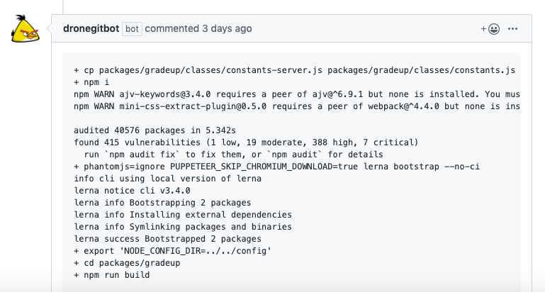

# drone-github-comment

Drone plugin that adds build errors as Github Comment on Pull Requests to skip visiting through Drone pages to find issue.



## Build

Build the binary with the following command:

```console
export GOOS=linux
export GOARCH=amd64
export CGO_ENABLED=0
export GO111MODULE=on
go build main.go -o gitdrone
```

## Docker

Build the Docker image with the following command:

```console
docker build .
```

## Usage

Set the following using Environment variables or as secrets
- GITHUB_APP_ID (38899) 
- GITHUB_INSTALLATION_ID (https://github.com/apps/dronegitbot : Install and get your installation ID) 
- PRIVATE_KEY (From Github App Installation)
- DRONE_ACCESS_TOKEN (From your Drone login profile)

## Example Configuration

```console
- name: update-status-to-github
  image: codehimanshu/gitdrone:1.6
  environment:
    DRONE_PULL_REQUEST: ${DRONE_PULL_REQUEST}
    DRONE_REPO_OWNER: ${DRONE_REPO_NAMESPACE}
    DRONE_REPO_NAME: ${DRONE_REPO_NAME}
    DRONE_ACCESS_TOKEN:
      from_secret: DRONE_ACCESS_TOKEN
    DRONE_HOST: ${DRONE_SYSTEM_HOST}
    DRONE_BUILD_NUMBER: ${DRONE_BUILD_NUMBER}
    GITHUB_INSTALLATION_ID:
      from_secret: GITHUB_INSTALLATION_ID
    GITHUB_APP_ID:
      from_secret: GITHUB_APP_ID
    PRIVATE_KEY:
      from_secret: PRIVATE_KEY
  when:
    status: [ failure ]
    event: pull_request
```

- Add the pipeline step at the end of your pipeline
- Change Event as per your requirement
- Do not change Status from failure as the plugins wont find any error
- DRONE_PULL_REQUEST, DRONE_REPO_NAMESPACE, DRONE_REPO_NAME, DRONE_SYSTEM_HOST, DRONE_BUILD_NUMBER are passed automatically by Drone Server.
- DRONE_ACCESS_TOKEN, GITHUB_INSTALLATION_ID, GITHUB_APP_ID and PRIVATE_KEY are required for each build and fetched from Secrets by default.
